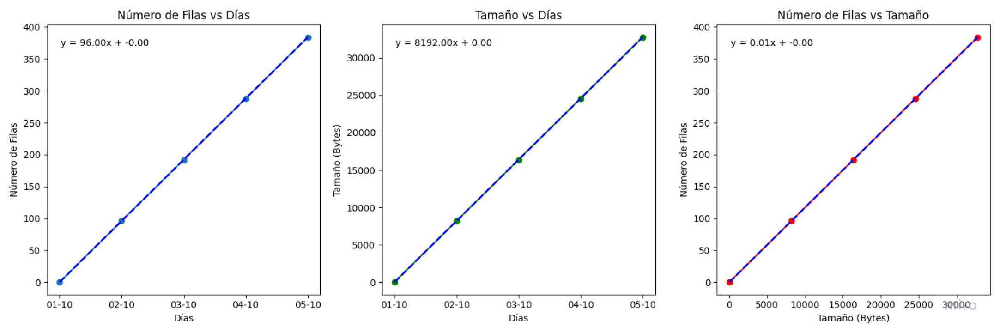
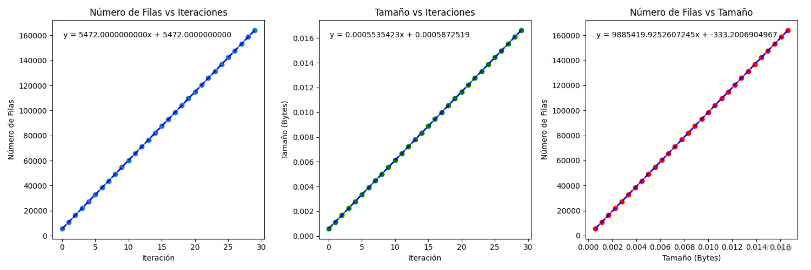

# Volume Analysis

Auxiliar project to help estimate the growth of registers stations over the time. It might not work after refactor since it used components from monorepo.

Results of previews run are shown. 

## Growth using samples of 5 days

## Growth using samples of days

